# DevSecOps GitOps Pipeline on AKS


An end-to-end **DevSecOps GitOps pipeline** deployed on **Azure Kubernetes Service (AKS)**.

#  DevSecOps GitOps Pipeline on Azure AKS

## 📌 Project Description

This project demonstrates a **complete end‑to‑end DevSecOps and GitOps workflow** implemented using modern cloud‑native tools.

The objective of this project is to automate:

✔ Infrastructure provisioning  
✔ Continuous Integration (CI)  
✔ Security scanning  
✔ Container image management  
✔ Continuous Deployment (CD)  
✔ GitOps based deployment to Kubernetes  

The project deploys a **JavaScript Infinite Mario Game application** automatically into an **Azure Kubernetes Service (AKS)** cluster.

---

#  Project Goals

The main goals of this project:

- Implement a **complete DevSecOps pipeline**
- Automate **secure container builds**
- Integrate **static code analysis**
- Integrate **container vulnerability scanning**
- Use **GitOps principles for deployment**
- Automate infrastructure provisioning using **Terraform**
- Deploy workloads automatically to **Azure Kubernetes Service**

---

#  Architecture

The architecture of this project follows a **DevSecOps + GitOps model**.

```
Developer
   │
   ▼
GitHub Repository
   │
   ▼
GitHub Actions Pipeline
   │
   ├── SonarQube (SAST Code Analysis)
   ├── Docker Build
   ├── Docker Push → DockerHub
   ├── Trivy Container Scan
   └── Update Kubernetes Manifests
           │
           ▼
        GitOps Repo
           │
           ▼
        ArgoCD
           │
           ▼
   Azure Kubernetes Service (AKS)
           │
           ▼
     Running Application
```

---

# Cloud Infrastructure

Infrastructure is provisioned using **Terraform**.

Terraform creates:

- Azure Resource Group
- Azure Kubernetes Service Cluster
- Node Pools
- Networking configuration

Example Terraform resource:

```hcl
resource "azurerm_kubernetes_cluster" "aks_cluster" {
  name                = var.aks_cluster_name
  location            = azurerm_resource_group.aks_rg.location
  resource_group_name = azurerm_resource_group.aks_rg.name
  dns_prefix          = var.dns_prefix

  default_node_pool {
    name       = "system"
    node_count = 1
    vm_size    = var.vm_size
  }
}
```

📷 Infrastructure configuration

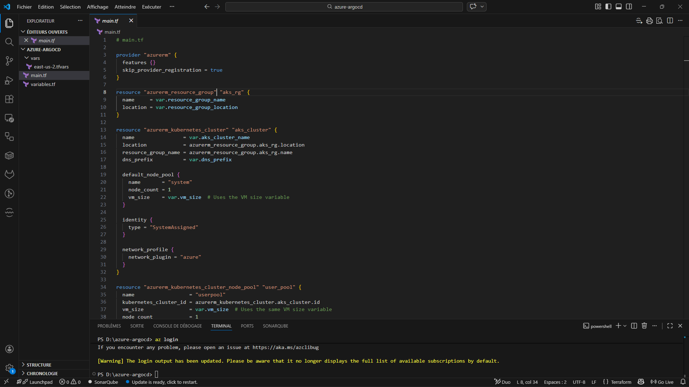

---

# Kubernetes Cluster (AKS)

The application is deployed on **Azure Kubernetes Service**.

AKS provides:

- Managed Kubernetes control plane
- Auto scaling capabilities
- Integration with Azure networking
- Secure cluster identity

Node configuration:

```
Node Pool Type: System + User
VM Size: Standard_B2s
Node Count: 1
Network Plugin: Azure CNI
```
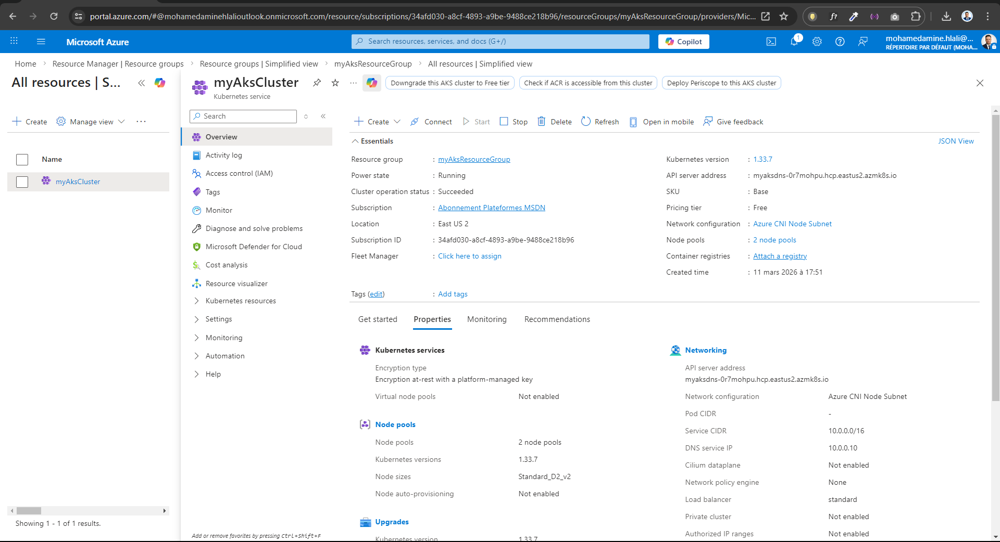

---

# GitOps Deployment with ArgoCD

The project uses **ArgoCD** to implement GitOps.

ArgoCD continuously monitors the Git repository containing Kubernetes manifests.

Whenever changes occur:

1️ ArgoCD detects Git changes  
2️ ArgoCD syncs cluster state  
3️ Kubernetes resources are updated automatically  

📷 ArgoCD installation and configuration

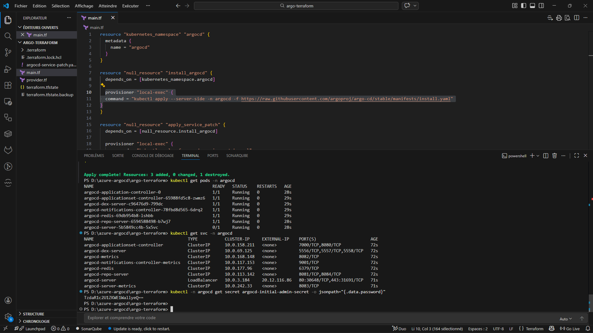
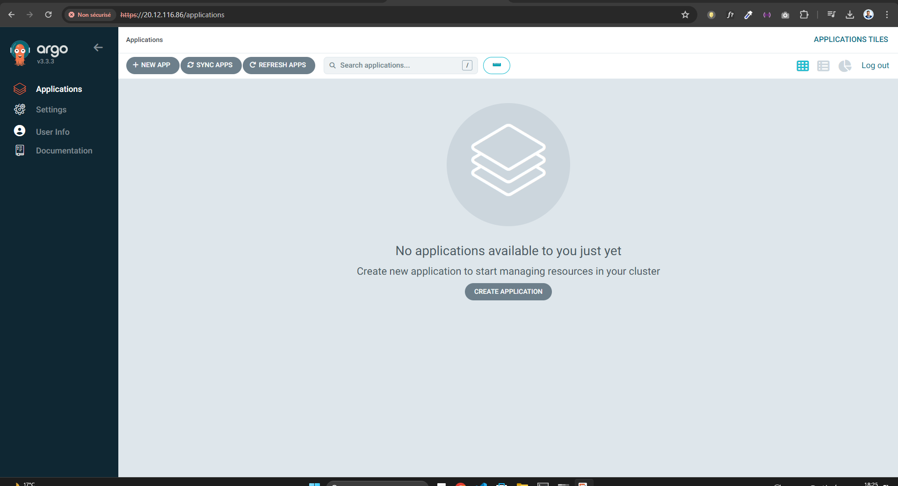
---

#  CI/CD Pipeline (GitHub Actions)

The CI/CD pipeline is implemented using **GitHub Actions**.

Pipeline file:

```
.github/workflows/devsecops-pipeline.yml
```

Pipeline execution occurs automatically when code is pushed to the **main branch**.

Pipeline stages:

### 1️ SAST Code Analysis

Source code is scanned using **SonarQube**.

Checks include:

- Code bugs
- Vulnerabilities
- Code smells
- Security hotspots

SonarQube dashboard

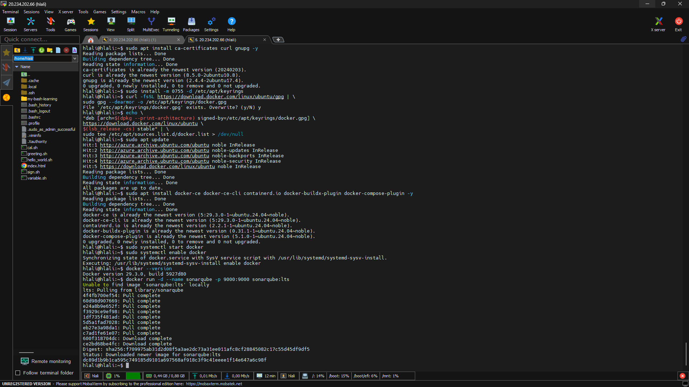

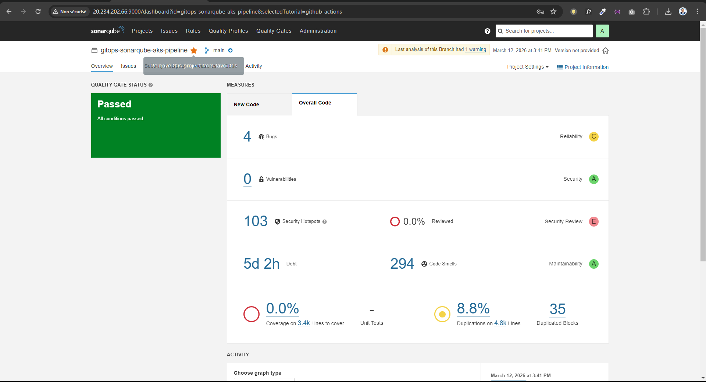

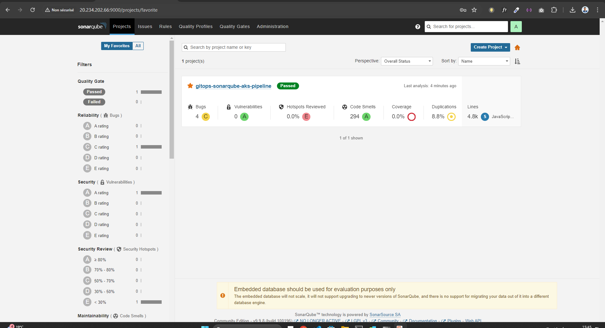

---

### 2️ Docker Image Build

The application is packaged into a Docker container.

Example step:

```yaml
- name: Build Docker Image
  run: docker build -t $IMAGE_NAME:$IMAGE_TAG .
```

---

### 3️ Push Image to DockerHub

The built image is pushed automatically to DockerHub.

```
medaminehlali/gitops-sonarqube-aks-pipeline
```

📷 DockerHub repository

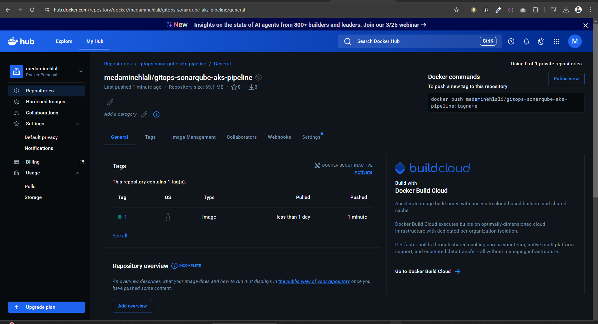

---

### 4️ Container Vulnerability Scan

Container images are scanned using **Trivy**.

Security checks include:

- OS vulnerabilities
- Library vulnerabilities
- Critical / High CVEs

Example:

```yaml
- name: Scan Docker Image with Trivy
  uses: aquasecurity/trivy-action
```
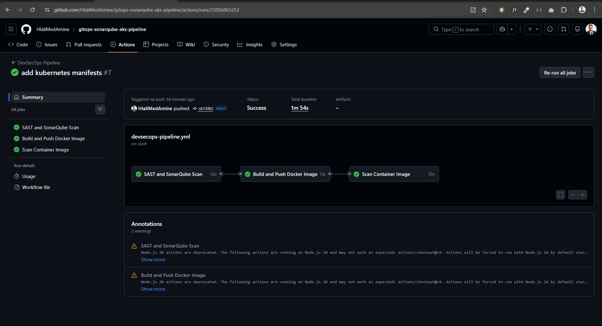


---

### 5️ Update Kubernetes Manifest

After the image is pushed:

The pipeline updates the Kubernetes deployment manifest with the new image tag.

Example:

```
image: medaminehlali/gitops-sonarqube-aks-pipeline:7
```

---

#  Pipeline Execution

GitHub Actions pipeline execution.

📷 Pipeline status


Pipeline stages:

```
SAST Scan
Build Docker Image
Push Image
Trivy Scan
Update Kubernetes Manifest
```

---

#  GitOps Deployment

ArgoCD deploys the application automatically.

📷 ArgoCD application sync

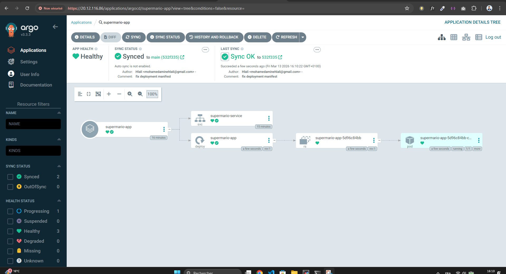

Deployment state:

```
Application Status: Healthy
Sync Status: Synced
Pods: Running
```

---

#  Running Application

The deployed application is a **JavaScript Infinite Mario Game**.

📷 Running application

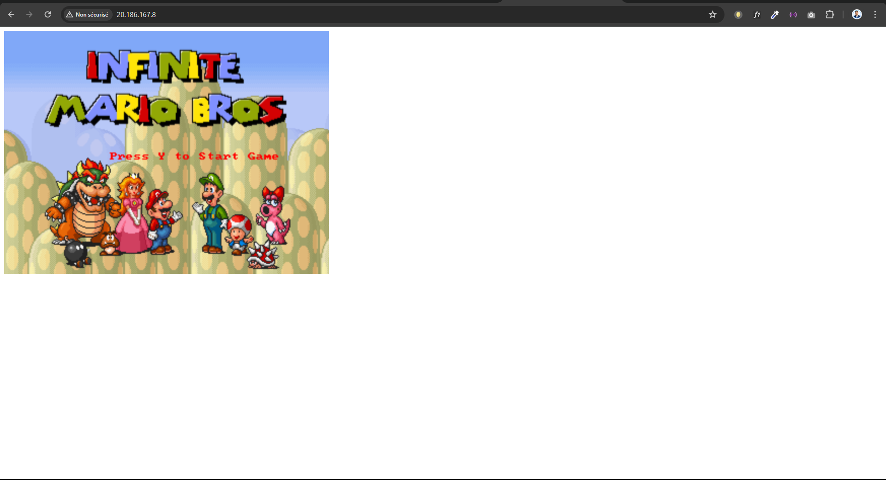

The application is exposed using a **Kubernetes LoadBalancer Service**.

Access example:

```
http://EXTERNAL-IP
```

---

#  Repository Structure

```
.
├── terraform
│   ├── main.tf
│   ├── variables.tf
│   └── terraform.tfvars
│
├── k8s
│   ├── deployment.yaml
│   └── service.yaml
│
├── .github
│   └── workflows
│        └── devsecops-pipeline.yml
│
├── Dockerfile
├── app
└── README.md
```

---

#  Security Implementation

Security is implemented at multiple stages:

### Code Security
- SonarQube SAST analysis

### Container Security
- Trivy vulnerability scanning

### Infrastructure Security
- Managed AKS identities
- Secure container registry usage

### GitOps Security
- Immutable infrastructure
- Git as single source of truth

---

# Complete Deployment Flow

```
1 Developer pushes code
2 GitHub Actions pipeline starts
3 SonarQube scans source code
4 Docker image is built
5 Image pushed to DockerHub
6 Trivy scans container image
7 Kubernetes manifest updated
8 ArgoCD detects change
9 Application deployed to AKS
```

---

# Future Improvements

Possible improvements for this project:

- Helm chart deployment
- Prometheus monitoring
- Grafana dashboards
- Azure Key Vault integration
- ArgoCD auto‑sync policies
- Kubernetes HPA autoscaling

---

# Author

Med Amine Hlali  
DevOps / Cloud Engineer

GitHub:
https://github.com/HlaliMedAmine

---

## License

This project is licensed under the MIT License.

You are free to use, modify, and distribute this project.

# ⭐ If you like this project

Consider giving the repository a star ⭐
