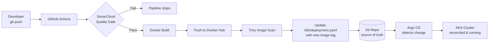

<div align="center">

# 🚀 DevSecOps GitOps Pipeline on Azure Kubernetes Service (AKS)

**An end-to-end, security-first CI/CD platform that ships a containerized application to Kubernetes — automatically, safely, and reproducibly.**


</div>

---

## 📖 Table of Contents

1. [Overview](#-overview)
2. [Architecture](#-architecture)
3. [Tech Stack](#-tech-stack)
4. [Repository Structure](#-repository-structure)
5. [How It Works (End-to-End Flow)](#-how-it-works-end-to-end-flow)
6. [Prerequisites](#-prerequisites)
7. [Step-by-Step Deployment Guide](#-step-by-step-deployment-guide)
8. [The CI/CD Pipeline Explained](#️-the-cicd-pipeline-explained)
9. [Security (DevSecOps) Controls](#-security-devsecops-controls)
10. [Verifying the GitOps Loop](#-verifying-the-gitops-loop)
11. [Results & Screenshots](#-results--screenshots)
12. [Teardown](#-teardown)
13. [What I Learned](#-what-i-learned)
14. [Author](#-author)

---

## 🎯 Overview

This project demonstrates a **complete, production-style DevSecOps workflow** that takes application code from a developer's laptop all the way to a running workload on **Azure Kubernetes Service** — with **zero manual `kubectl apply` at deploy time**.

The application being deployed is a browser-based **Infinite Mario** game (JavaScript, served by Tomcat in a container). The *application itself is intentionally simple* — the real engineering value is in the **platform around it**:

- **Infrastructure as Code** provisions the entire Azure footprint (Terraform).
- **Continuous Integration** builds, scans, and publishes a container image on every push (GitHub Actions).
- **Security gates** block insecure code and images before they reach the cluster (SonarCloud + Trivy).
- **GitOps Continuous Delivery** keeps the cluster state continuously reconciled with Git (Argo CD).

> 💡 **Why this matters:** This is the same pattern used by platform/DevOps teams in production — declarative infrastructure, automated security, and Git as the single source of truth for what runs in production.

---

## 🏗 Architecture


The platform is built around six automated stages:

| # | Stage | Tool | Purpose |
|---|-------|------|---------|
| 1 | **Develop** | VS Code | Engineer writes application + manifest code |
| 2 | **Commit** | Git / GitHub | Push triggers the pipeline; Git is the source of truth |
| 3 | **Build & Publish** | GitHub Actions + Docker Hub | Build container image, tag it, push to registry |
| — | **Static Analysis** | SonarCloud | SAST scan blocks code that fails the Quality Gate |
| — | **Image Scan** | Trivy | Scans the image for CRITICAL/HIGH CVEs |
| 5 | **Update Manifest** | GitHub Actions | Pipeline writes the new image tag into the K8s manifest |
| 6 | **Deploy (GitOps)** | Argo CD on AKS | Argo CD detects the Git change and syncs it to the cluster |

---

## 🧰 Tech Stack

| Layer | Technology |
|-------|------------|
| **Cloud** | Microsoft Azure |
| **Orchestration** | Azure Kubernetes Service (AKS) |
| **Infrastructure as Code** | Terraform |
| **CI** | GitHub Actions |
| **CD / GitOps** | Argo CD |
| **Static Code Analysis (SAST)** | SonarCloud |
| **Container Vulnerability Scanning** | Trivy |
| **Container Registry** | Docker Hub |
| **Runtime** | Docker + Tomcat |
| **Application** | Infinite Mario (JavaScript) |

---

## 📂 Repository Structure

```
devsecops-aks-pipeline/
├── .github/workflows/
│   └── devsecops-pipeline.yml      # CI: SAST → build → scan → update manifest
├── aks-terraform/                  # IaC: provisions the AKS cluster  ── see its README
│   ├── main.tf
│   ├── variables.tf
│   └── vars/east-us-2.tfvars
├── argo-terraform/                 # IaC: installs Argo CD + registers the app ── see its README
│   ├── main.tf
│   ├── provider.tf
│   ├── argocd-service-patch.yaml
│   └── supermario-application.yaml
├── k8s/                            # Kubernetes manifests synced by Argo CD ── see its README
│   ├── deployment.yaml
│   └── service.yaml
├── webapp/                         # The Infinite Mario application source
├── Dockerfile                      # Container build definition (non-root, hardened)
├── sonar-project.properties        # SonarCloud project configuration
└── README.md                       # You are here
```

📌 **Each infrastructure folder has its own focused README** with the exact commands to run:
- [`aks-terraform/README.md`](aks-terraform/README.md) — provision the AKS cluster
- [`argo-terraform/README.md`](argo-terraform/README.md) — install Argo CD & register the app
- [`k8s/README.md`](k8s/README.md) — the application manifests Argo CD manages

---

## 🔄 How It Works (End-to-End Flow)



The key insight: **the pipeline never deploys directly to the cluster.** It only updates Git. Argo CD — running *inside* the cluster — continuously watches Git and pulls changes in. This is the **GitOps pull model**, which is more secure and auditable than pushing credentials into CI.

---

## ✅ Prerequisites

Install and authenticate the following before you start:

| Tool | Purpose | Verify |
|------|---------|--------|
| [Azure CLI](https://learn.microsoft.com/cli/azure/install-azure-cli) | Manage Azure resources | `az version` |
| [Terraform](https://developer.hashicorp.com/terraform/install) ≥ 1.3 | Provision infrastructure | `terraform version` |
| [kubectl](https://kubernetes.io/docs/tasks/tools/) | Talk to the cluster | `kubectl version --client` |
| [Docker](https://docs.docker.com/get-docker/) | Build images locally (optional) | `docker version` |
| A **Docker Hub** account | Host the container image | — |
| A **SonarCloud** account | Run the SAST scan | — |

```bash
# Authenticate to Azure and select your subscription
az login
az account set --subscription "<your-subscription-id>"
```

### Required GitHub Secrets

Configure these under **Repo → Settings → Secrets and variables → Actions**:

| Secret | Description |
|--------|-------------|
| `SONAR_TOKEN` | SonarCloud analysis token |
| `SONAR_HOST_URL` | `https://sonarcloud.io` |
| `DOCKERHUB_USERNAME` | Docker Hub username |
| `DOCKERHUB_TOKEN` | Docker Hub access token |

---

## 🚀 Step-by-Step Deployment Guide

> Follow these stages in order. Each infrastructure folder also has a dedicated README with deeper detail.

### Stage 1 — Provision the AKS Cluster (Terraform)

```bash
cd aks-terraform
terraform init
terraform plan  -var-file="vars/east-us-2.tfvars"
terraform apply -var-file="vars/east-us-2.tfvars" -auto-approve
```

This creates a resource group, an AKS cluster (system + user node pools), a managed identity, and Azure CNI networking.


Connect `kubectl` to the new cluster:

```bash
az aks get-credentials \
  --resource-group ike-myAksResourceGroup \
  --name ike-myAksCluster \
  --overwrite-existing

kubectl get nodes
```

.png)

📁 **Detailed walkthrough:** [`aks-terraform/README.md`](aks-terraform/README.md)

---

### Stage 2 — Install Argo CD & Register the App (Terraform)

```bash
cd ../argo-terraform
terraform init
terraform apply -auto-approve
```

This creates the `argocd` namespace, installs Argo CD, and exposes the Argo CD server via a `LoadBalancer`.


Register the application so Argo CD begins watching the `k8s/` folder:

```bash
kubectl apply -f supermario-application.yaml
kubectl get applications -n argocd
```

📁 **Detailed walkthrough:** [`argo-terraform/README.md`](argo-terraform/README.md)

---

### Stage 3 — Trigger the CI/CD Pipeline

Simply push to `main`. GitHub Actions handles the rest:

```bash
git add .
git commit -m "feat: trigger devsecops pipeline"
git push origin main
```


---

### Stage 4 — Argo CD Deploys to the Cluster

Argo CD detects the manifest change and reconciles the cluster automatically.


---

### Stage 5 — Access the Running Application

```bash
kubectl get svc supermario-service -n default
```


Open the `EXTERNAL-IP` in your browser:


🎉 **The application is live, deployed entirely through code and GitOps.**

---

## ⚙️ The CI/CD Pipeline Explained

The workflow lives in [`.github/workflows/devsecops-pipeline.yml`](.github/workflows/devsecops-pipeline.yml) and runs on every push to `main`. It is split into four sequential jobs:

| Job | What it does | Why |
|-----|--------------|-----|
| **`sast_sonar_scan`** | Runs SonarCloud SAST analysis | Catches bugs, vulnerabilities & code smells before build |
| **`build_and_push_docker`** | Builds the image & pushes to Docker Hub | Produces a versioned, immutable artifact (tagged with the run number) |
| **`scan_container_image`** | Scans the image with Trivy | Detects CRITICAL/HIGH OS & library CVEs |
| **`update_k8s_manifest`** | Rewrites the image tag in `k8s/deployment.yaml` and commits it back | Hands deployment off to Argo CD (GitOps) |

```yaml
# Image is tagged with the workflow run number for traceability
env:
  IMAGE_NAME: emekaezedozie276/devsecops-aks-pipeline
  IMAGE_TAG: ${{ github.run_number }}
```

The final job writes the new tag back into Git — **this commit is what Argo CD reacts to.**


---

## 🔒 Security (DevSecOps) Controls

Security is enforced at **three layers**, not bolted on at the end:

### 1. Static Application Security Testing (SAST) — SonarCloud
Every push is analyzed against the **Sonar Quality Gate**. The build fails if new code introduces vulnerabilities or drops below the required security rating.


After remediation, the project passes cleanly — **Security Rating A, Quality Gate Passed**:


**Hardening applied to reach a passing gate included:**
- Scoped GitHub Actions `permissions` to the job level (least privilege).
- Removed direct secret expansion inside `run:` blocks (passed via `env:` instead).
- Added **Subresource Integrity (SRI)** `integrity` + `crossorigin` attributes to external `<script>` tags.
- Disabled Kubernetes **service-account token automounting** (`automountServiceAccountToken: false`).
- Switched the container to run as a **non-root user** in the [`Dockerfile`](Dockerfile).

### 2. Container Image Scanning — Trivy
The published image is scanned for known CVEs in OS packages and libraries before it is considered deployable.

### 3. GitOps Pull-Based Delivery — Argo CD
Because Argo CD *pulls* from Git instead of CI *pushing* to the cluster, **no cluster credentials ever live in the CI system** — a significant reduction in attack surface.

---

## 🔁 Verifying the GitOps Loop

Want to prove the loop actually works? Change the replica count in Git and watch the cluster follow:

```bash
# 1. Edit k8s/deployment.yaml  ->  replicas: 2
git commit -am "test(gitops): scale to 2 replicas"
git push origin main

# 2. Argo CD detects the change and reconciles automatically
kubectl get applications -n argocd                  # SYNC: Synced, HEALTH: Healthy
kubectl get deployment supermario-app -n default    # READY 2/2
```

No `kubectl apply`. No manual deploy. **Git is the only thing you touched** — Argo CD did the rest.

You can also confirm the Argo CD control-plane services and the Azure resource footprint:


---

## 📸 Results & Screenshots

| Stage | Evidence |
|-------|----------|
| Architecture | [Architecture diagram](images/DevsecOps%20Architecture.jpeg) |
| Infrastructure provisioned | [Infrastructure config](images/Infrastructure%20%20Configuration.png) |
| AKS cluster | [AKS in Azure portal](images/Kubernetes%20Cluster%20(AKS).png) |
| Azure resources | [Resource group](images/resources.png) |
| SAST scan | [SonarCloud overview](images/sonarqube%20dashboard%20overview.png) · [Quality Gate passed](images/sonarqube%20dash%20board%20summary.png) |
| Image registry | [Docker Hub](images/DockerHub%20repository.png) |
| CI pipeline | [GitHub Actions](images/GitHub%20Actions%20pipeline%20Status.png) |
| GitOps deploy | [Argo CD synced](images/ArgoCD%20application%20sync.png) · [Argo services](images/kubectl%20get%20svc%20-n%20argo.png) |
| Live app | [Service IP](images/cluster%20IP.png) · [Running game](images/Running%20Application.png) |

---

## 🧹 Teardown

Destroy everything to avoid ongoing Azure charges:

```bash
# Remove Argo CD + application
cd argo-terraform
terraform destroy -auto-approve

# Remove the AKS cluster and resource group
cd ../aks-terraform
terraform destroy -var-file="vars/east-us-2.tfvars" -auto-approve
```

---

## 🎓 What I Learned

- Designing a **pull-based GitOps** delivery model and why it is more secure than push-based CD.
- Writing **modular Terraform** to provision and tear down cloud infrastructure reproducibly.
- Building a **multi-stage, security-gated CI pipeline** in GitHub Actions.
- Driving a **SonarCloud Quality Gate from failing to passing** by remediating real findings (least-privilege CI permissions, secret handling, SRI, non-root containers, K8s hardening).
- Operating **Argo CD** and validating continuous reconciliation between Git and a live cluster.

---

## 👤 Author

**Ikenna Ubah** — Cloud / DevSecOps Platform Engineer

[](https://github.com/Ike-DevCloudIQ)
[](https://www.linkedin.com/in/ikenna2/)

> ⭐ If you found this project useful or insightful, please consider starring the repository.

---

<div align="center">
<sub>Built with Terraform · GitHub Actions · SonarCloud · Trivy · Argo CD · Azure Kubernetes Service</sub>
</div>
