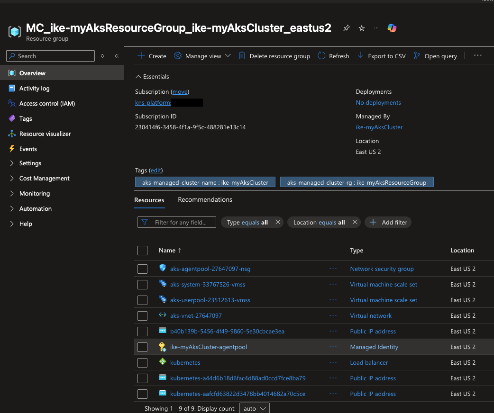

# 🏗 `aks-terraform` — Provision the Azure Kubernetes Service Cluster

This Terraform module provisions the **foundation** of the platform: the Azure resource group and a managed **AKS cluster** with a system and user node pool. This is **Stage 1** of the deployment.

> ⬅️ Back to the [main project README](../README.md)

---

## What this module creates

| Resource | Terraform resource | Notes |
|----------|--------------------|-------|
| Resource Group | `azurerm_resource_group.aks_rg` | Container for all Azure resources |
| AKS Cluster | `azurerm_kubernetes_cluster.aks_cluster` | Managed control plane, `SystemAssigned` identity |
| System node pool | `default_node_pool` | Runs cluster-critical workloads |
| User node pool | `azurerm_kubernetes_cluster_node_pool.user_pool` | Runs application workloads |
| Networking | `network_profile { network_plugin = "azure" }` | Azure CNI |

.png)

---

## Configuration

All environment-specific values live in [`vars/east-us-2.tfvars`](vars/east-us-2.tfvars):

```hcl
resource_group_name     = "ike-myAksResourceGroup"
resource_group_location = "eastus2"
aks_cluster_name        = "ike-myAksCluster"
dns_prefix              = "ike-myaksdns"
vm_size                 = "Standard_B2s"
```

| Variable | Description |
|----------|-------------|
| `resource_group_name` | Name of the Azure resource group |
| `resource_group_location` | Azure region (e.g. `eastus2`) |
| `aks_cluster_name` | Name of the AKS cluster |
| `dns_prefix` | DNS prefix for the cluster API server |
| `vm_size` | VM size for both node pools |

---

## Prerequisites

```bash
az login
az account set --subscription "<your-subscription-id>"
terraform version   # >= 1.3
```

---

## Step-by-step

### 1. Initialize Terraform
Downloads the `azurerm` provider and sets up the working directory.

```bash
cd aks-terraform
terraform init
```

### 2. Review the execution plan
See exactly what will be created before anything happens.

```bash
terraform plan -var-file="vars/east-us-2.tfvars"
```

### 3. Apply
Provision the cluster (takes a few minutes).

```bash
terraform apply -var-file="vars/east-us-2.tfvars" -auto-approve
```


### 4. Connect `kubectl` to the cluster

```bash
az aks get-credentials \
  --resource-group ike-myAksResourceGroup \
  --name ike-myAksCluster \
  --overwrite-existing
```

### 5. Verify the nodes are ready

```bash
kubectl get nodes
```

You should see system and user nodes in `Ready` state.



---

## ➡️ Next step

Proceed to [`argo-terraform/README.md`](../argo-terraform/README.md) to install Argo CD and register the application.

---

## 🧹 Teardown

```bash
terraform destroy -var-file="vars/east-us-2.tfvars" -auto-approve
```
