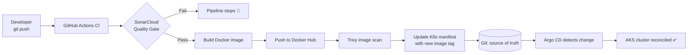

# DevSecOps GitOps Platform on Azure AKS — Project Showcase

> A walkthrough of a production-style DevSecOps platform I designed, built, secured, and operated end to end.
>
> 👤 **Ikenna Ubah** — Cloud / DevSecOps & Platform Engineer
> 🔗 [LinkedIn](https://www.linkedin.com/in/ikenna2/) · [GitHub](https://github.com/Ike-DevCloudIQ)
> 📄 Full technical docs: [main README](../README.md)

---

## 🎤 The 30-Second Pitch

I built a **fully automated, security-first software delivery platform** on **Azure Kubernetes Service (AKS)**. A developer simply pushes code to GitHub — and from there, the platform **automatically** scans the code for vulnerabilities, builds and scans a container image, and deploys it to a live Kubernetes cluster using **GitOps**, with **no human running deployment commands**.

The result is a pipeline that is **repeatable, auditable, and secure by design** — the same pattern modern platform teams use to ship software safely at scale.

---

## 🧩 The Problem I Set Out to Solve

Many teams still deploy software manually: someone runs commands against production, credentials get copied around, security checks happen *after* release (if at all), and there's no single source of truth for what's actually running.

This creates four recurring pain points:

1. **Human error** — manual `kubectl apply` and ad-hoc fixes drift the cluster away from what's in version control.
2. **Weak security posture** — vulnerabilities are caught late, in production, instead of in the pipeline.
3. **Credential sprawl** — CI systems holding cluster admin credentials are a large attack surface.
4. **No auditability** — it's hard to answer "who changed what, and when?"

**My goal:** design a platform where **Git is the single source of truth**, **security is automated and enforced**, and **deployment is hands-off**.

---

## 🏗 What I Built

A complete CI/CD + GitOps platform composed of five integrated layers:

| Layer | Technology | What it delivers |
|-------|-----------|------------------|
| **Infrastructure as Code** | Terraform | One-command provisioning/teardown of the entire Azure footprint |
| **Container Build & Registry** | Docker + Docker Hub | Versioned, immutable, hardened images |
| **Continuous Integration** | GitHub Actions | Multi-stage pipeline triggered on every push |
| **Security Gates** | SonarCloud (SAST) + Trivy (image scanning) | Insecure code/images are blocked before deploy |
| **Continuous Delivery (GitOps)** | Argo CD on AKS | Cluster continuously reconciled to match Git |

The demo workload is a containerized **Infinite Mario** game — deliberately simple, so the spotlight stays on the **engineering of the platform**, not the app.

> 📐 Full architecture diagram and step-by-step screenshots are in the [main README](../README.md).

---

## 🔄 How It Works (End to End)

The crucial design decision: **the CI pipeline never deploys to the cluster directly.** It only commits the new image tag to Git. **Argo CD — running inside the cluster — pulls the change in.** This "pull-based GitOps" model means the CI system never needs cluster credentials, dramatically shrinking the attack surface.

---

## 🛡 Security: Built In, Not Bolted On

I enforced security at **three independent layers** so a single missed check can't ship a vulnerability:

1. **Static Application Security Testing (SAST)** — SonarCloud analyzes every push against a **Quality Gate**. If new code introduces vulnerabilities or drops below an "A" security rating, the build **fails**.
2. **Container Image Scanning** — Trivy scans every built image for **CRITICAL/HIGH CVEs** in OS packages and libraries before it's considered deployable.
3. **GitOps Pull Model** — Argo CD pulls from Git, so **no cluster credentials live in CI**.

---

## 🔧 Real Issues I Encountered & How I Troubleshot Them

This is where the real engineering happened. A few highlights:

### 1. A failing SonarCloud Quality Gate (Security Rating "C")
**Problem:** My pipeline's first security scan failed the gate — the project scored a **C** on security with multiple open vulnerabilities across the workflow, Kubernetes manifests, Dockerfile, and HTML.

**My approach:**
- Read each Sonar finding individually rather than blanket-suppressing them.
- Remediated each at the root cause:
  - **Least privilege CI** — removed broad workflow-level `permissions: write` and scoped them to only the job that needs them.
  - **Secret handling** — stopped expanding secrets directly inside `run:` shell blocks; passed them via `env:` instead.
  - **Subresource Integrity (SRI)** — added `integrity` + `crossorigin` attributes to externally-loaded `<script>` tags.
  - **Kubernetes hardening** — set `automountServiceAccountToken: false` (the pod doesn't need API access).
  - **Container hardening** — switched the image to run as a **non-root user** in the Dockerfile.

**Outcome:** Quality Gate **Passed**, Security Rating **A**, **0 open security issues**.

### 2. "Phantom" edits — git showed no changes after I edited files
**Problem:** After applying edits, `git status` reported "nothing to commit," even though the changes looked applied.

**Diagnosis:** A mismatch between the editor's in-memory buffer and what was actually written to disk. I verified by inspecting the file directly on disk with `git diff`.

**Resolution:** Wrote changes deterministically to disk and confirmed each edit with `git diff` before committing — turning an invisible failure into a verifiable step.

### 3. Repeated push rejections (remote ahead of local)
**Problem:** Pushes were rejected because the pipeline's own automated commit (the GitOps manifest update, tagged `[skip ci]`) advanced `main` between my local commits.

**Resolution:** Adopted a consistent `git pull --rebase origin main && git push` flow to cleanly replay my work on top of the automated commits — keeping history linear and conflict-free.

### 4. Proving the GitOps loop actually works
**Problem:** It's easy to *claim* GitOps; I wanted to *prove* the cluster truly follows Git.

**Validation:** I changed the deployment's replica count in Git, pushed, and watched **Argo CD reconcile the cluster from 1 → 2 replicas automatically** — `2/2 Running`, with **zero manual `kubectl apply`**. Application showed **Synced / Healthy**, served behind an Azure LoadBalancer public IP.

---

## 📊 What I Achieved

- ✅ **Zero-touch deployments** — push to Git, the platform does the rest.
- ✅ **Security Rating A** with a **passing Quality Gate** and **0 open security issues**.
- ✅ **Reproducible infrastructure** — the entire AKS environment stands up (and tears down) from Terraform.
- ✅ **Immutable, traceable artifacts** — every image tagged with the pipeline run number.
- ✅ **Validated GitOps reconciliation** — demonstrably driven by Git, not manual commands.
- ✅ **Reduced attack surface** — no cluster credentials in CI.

---

## 💡 What I Learned

- **GitOps is a security model, not just a deployment style.** Pull-based delivery removes an entire class of credential-leak risk.
- **Security findings are most valuable when fixed at the root cause** — chasing the "why" behind each Sonar rule made me a better engineer than simply silencing warnings would have.
- **Verify, don't assume.** Whether it was disk-vs-buffer edits or GitOps reconciliation, confirming the real state (`git diff`, `kubectl get`) caught issues that surface-level checks missed.
- **Automation must be observable.** Tagging images by run number and using Argo CD's sync/health status made the whole system auditable at a glance.
- **Modular Terraform pays off.** Splitting cluster provisioning from Argo CD installation kept concerns clean and teardown safe.

---

## 🎯 Why This Project Matters

This project mirrors **exactly how high-performing platform teams ship software today**: declarative infrastructure, security gates that block bad code automatically, and Git as the auditable single source of truth for production.

For a hiring team, it demonstrates that I can:

- **Design** a secure, end-to-end delivery platform — not just isolated scripts.
- **Integrate** multiple tools (Terraform, GitHub Actions, SonarCloud, Trivy, Argo CD, AKS) into one coherent system.
- **Diagnose and resolve** real-world failures methodically, from security findings to Git workflow conflicts.
- **Operate** the platform and **prove** it works with concrete validation.
- **Communicate** technical decisions and trade-offs clearly.

In short: I can take a workload from a developer's commit to a **secure, automated, production-style deployment on Kubernetes** — and explain every decision along the way.

---

## 🧰 Tech Stack at a Glance

`Azure` · `AKS` · `Terraform` · `GitHub Actions` · `Docker` · `Docker Hub` · `SonarCloud` · `Trivy` · `Argo CD` · `Kubernetes`

---

## 📬 Let's Talk

I'd love to walk through the architecture, the troubleshooting decisions, or how I'd extend this (Helm, Prometheus/Grafana observability, Azure Key Vault, HPA autoscaling) for a real production environment.

🔗 **[LinkedIn — Ikenna Ubah](https://www.linkedin.com/in/ikenna2/)** · **[GitHub — Ike-DevCloudIQ](https://github.com/Ike-DevCloudIQ)**
