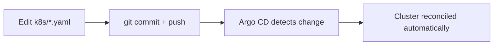

# ☸️ `k8s` — Application Kubernetes Manifests (Managed by Argo CD)

This folder is the **GitOps source of truth** for what runs in the cluster. **Argo CD watches this directory** and reconciles any change into AKS automatically — you should rarely, if ever, run `kubectl apply` here by hand.

> ⬅️ Back to the [main project README](../README.md)

---

## Files

| File | Kind | Purpose |
|------|------|---------|
| [`deployment.yaml`](deployment.yaml) | `Deployment` | Runs the Infinite Mario container |
| [`service.yaml`](service.yaml) | `Service` (LoadBalancer) | Exposes the app to the internet |

---

## `deployment.yaml`

```yaml
spec:
  replicas: 2
  template:
    spec:
      automountServiceAccountToken: false        # security hardening (Sonar k8s:S6865)
      containers:
      - name: supermario
        image: emekaezedozie276/devsecops-aks-pipeline:1   # tag auto-updated by CI
        ports:
        - containerPort: 8080
        resources:
          limits:   { memory: "128Mi", cpu: "500m" }
          requests: { memory: "64Mi",  cpu: "250m" }
```

**Key points:**
- The `image` tag is **rewritten automatically by the CI pipeline** on every push (it commits the new tag back to Git, which Argo CD then deploys).
- `automountServiceAccountToken: false` follows least-privilege best practice — the pod doesn't need API access.
- Resource `requests`/`limits` are set so the scheduler can place the pod and protect the node.

## `service.yaml`

```yaml
spec:
  type: LoadBalancer
  ports:
    - port: 80          # external port
      targetPort: 8080  # container port
```

A `LoadBalancer` Service provisions an Azure public IP and routes external traffic on port 80 to the container on 8080.

---

## How changes get deployed (GitOps)



You normally do **not** apply these manifests manually. Instead:

```bash
# Edit a manifest, then:
git add k8s/
git commit -m "chore: update app manifest"
git push origin main
# Argo CD syncs it within ~3 minutes (or click SYNC in the UI)
```

---

## Verifying the deployment

```bash
# Application status in Argo CD
kubectl get applications -n argocd          # Synced / Healthy

# Workload status
kubectl get deployment supermario-app -n default   # READY 2/2
kubectl get pods -n default

# Get the public IP and open it in a browser
kubectl get svc supermario-service -n default
```


---

## Manual apply (only if Argo CD is not used)

```bash
kubectl apply -f k8s/
```

> ⚠️ In normal operation Argo CD owns these resources. Manual edits to live objects will be reverted to match Git on the next sync.
